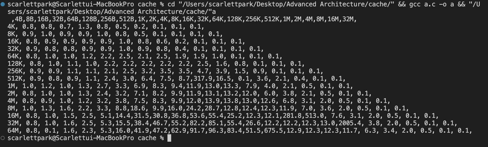
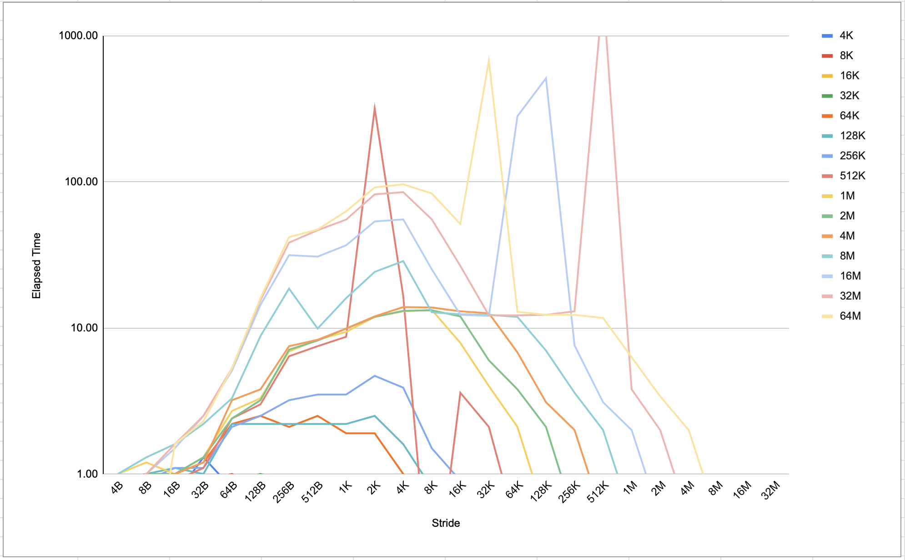

# Memory_Systems_Test

The code for generating the data is edited depends on my labtop's OS.

## Sample results after running the program locally

## Sample graph generated using the data above

## Questions

**bold text If necessary, modify the code in Figure 2.32 to measure the following system characteristics. Plot the experimental results with elapsed time on the y-axis and the memory stride on the x-axis. Use logarithmic scales for both axes, and draw a line for each cache size. bold text**

1. What is the system page size?

- Considering the graph that I created, it looks like there is an increase tendency at 1K which could be caused by L2 cache miss. Therefore, the page size is 1K. However, it is also important to note that there are spikes at other stride values, such as 4K and 32K, which could indicate that the system has different page sizes for different levels of the memory hierarchy. 

2. How many entries are there in the TLB?

- To detect TLB (Translation Lookaside Buffer) size from the graph, we should look for a sudden increase in elapsed time as the memory stride increases beyond a certain point. This sudden increase in elapsed time indicates that the program has reached the limit of the TLB and is now experiencing TLB misses. 
If the page size is 1K and considering the graph, we can observe that there is a significant increase in elapsed time at a memory stride of 1K, which indicates a possible TLB miss. This means that the TLB size could be smaller than 1K, as the processor has to access the main memory to retrieve the required translation entry. However, we cannot precisely determine the TLB size based on this data alone, as other factors such as cache size and memory latency can also influence the elapsed time.
If the TLB is a fully associative cache, then the TLB size in entries would also be 1. 

3.  What is the miss penalty for the TLB?

- If the increase at 1K is the page size and caused by the L2 cache miss, the penalty is roughly 18ns. 

4. What is the associativity of the TLB?

- It is difficult to determine the exact associativity of the TLB. However, if we guess assuming a page size of 1K,
At stride values of 1KB, 2KB, and 4KB, we can see that there are clear steps in the graph, indicating that there are likely a limited number of TLB entries that can map these page sizes. This suggests that the TLB is not fully associative, but instead, it may be set-associative with a relatively small number of sets.
At larger stride values, such as 32KB and 64KB, the graph shows a sharp increase in elapsed time, indicating that the TLB misses are becoming more expensive. This may suggest that the TLB is not large enough to map all the pages in this range, which could be due to a limited number of sets or limited total number of entries.

